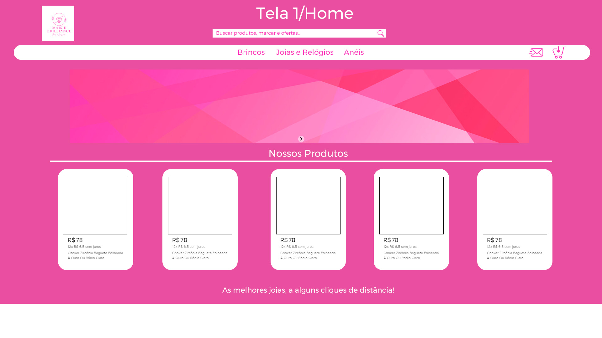
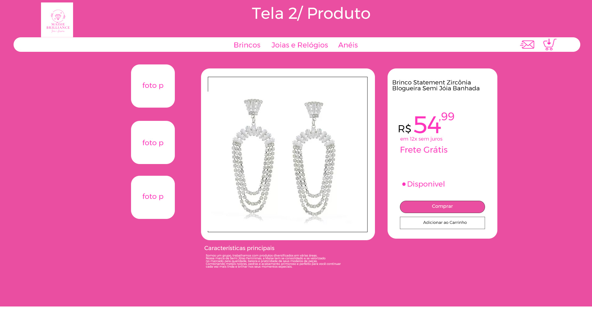
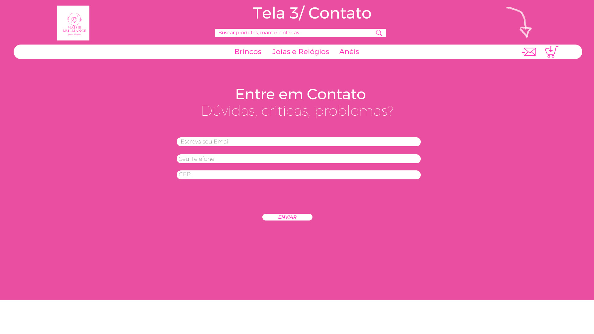
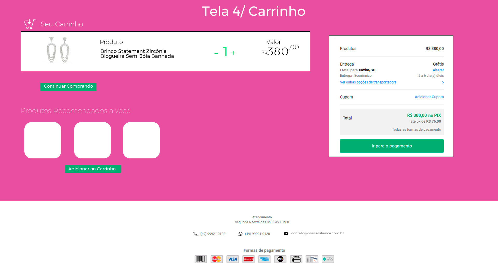

# Desenvolvimento do projeto

PRINCIPAIS RECURSOS E FUNCIONALIDADES

Descreva os principais recursos e funcionalidades que serão implementados no software. Liste as principais capacidades que o sistema oferecerá aos usuários e descreva-as brevemente.

3.1 Requisitos Funcionais

- Registro de Produtos:
  - O sistema deve permitir o cadastro de diferentes tipos de joias e looks respectivamente.
  - Deve ser possível adicionar informações detalhadas sobre cada produto, como preço, material, peso, tamanho e combinações.
- Catálogo On-line:
  - A loja deve ter uma interface de catálogo online que permita aos clientes visualizar os produtos disponíveis.
  - Os produtos devem ser categorizados para facilitar a navegação, como "Anéis", "Colares", "Brincos", etc.
  - Cada produto cadastrado deve ter sua combinação de looks.
- Carrinho de Compras:
  - Os clientes devem ser capazes de adicionar itens ao carrinho de compras.
  - Deve ser possível visualizar e atualizar o carrinho antes de finalizar uma compra.
- Processamento de Pagamento:
  - O sistema deve suportar várias opções de pagamento, como cartões de crédito, Pix e transferência bancária.
  - Deve ser seguro e garantir a proteção dos dados financeiros dos clientes.
- Conta do Cliente:

  - Os clientes devem poder criar contas pessoais para rastrear seus pedidos e informações de perfil.
  - A senha e as informações pessoais dos clientes devem ser armazenadas de forma segura.

    3.2 Requisitos Não Funcionais

- Desempenho:
  - O site deve ser responsivo e carregar rapidamente, mesmo em conexões de internet mais lentas.
  - Deve ser capaz de lidar com um grande número de acessos simultâneos durante promoções ou eventos especiais.
- Segurança:
  - Deve haver medidas de segurança robustas para proteger os dados dos clientes e informações financeiras.
  - Atualizações regulares de segurança devem ser inovadoras para evitar vulnerabilidades.
- Usabilidade:
  - A interface do usuário deve ser intuitiva e fácil de usar, proporcionando uma experiência única e agradável ao cliente, para que os mesmo tenham assertividade tanto na escolha das joias quanto nas combinações de looks.
  - Deve ser acessível em diferentes dispositivos, como smartphones, tablets e computadores.
- Disponibilidade:
  - O sistema deve estar disponível 24 horas por dia, 7 dias por semana, para permitir compras a qualquer momento.
  - Deve haver um plano de contingência em caso de interrupções no serviço.
- Backup e Recuperação de Dados:
  - Deve haver rotinas de backup regulares para garantir a recuperação de dados em caso de falha no sistema.
  - Um plano de recuperação de desastres deve ser previsto para lidar com situações inesperadas.
- Conformidade Legal:
  - A loja deve cumprir todas as leis e regulamentos aplicáveis ​​relacionados a vendas online, impostos e privacidade.

4. Diagrama de Caso de Uso

4.1 Descrição de Caso de Uso

"Descrever pelo menos 2"

5. DIAGRAMA DE CLASSE
   

6. PROTÓTIPO DE TELAS

7. CRONOGRAMA E ENTREGA

Apresente um cronograma geral do projeto, indicando as principais etapas, marcos e datas de entrega esperadas. Isso pode ser uma representação em formato de diagrama de Gantt ou uma lista de atividades e prazos.

ETAPA 1: **Planejamento (Semana 1-2)**

- Definir os objetivos do site
- Pesquisa de mercado
- Análise da concorrência
- Elaboração de requisitos e especificações do projeto

ETAPA 2: **Design (Semana 3-5)**

- Criação de wireframes
- Design de interface do usuário (UI)
- Desenvolvimento do design visual (mockups)
- Revisão e finalização das etapas design e planejamento

ETAPA 3: **Desenvolvimento Front-end (Semana 6-9)**

- Configuração do ambiente de desenvolvimento
- Implementação do layout e design no código
- Desenvolvimento da navegação e interatividade do site
- Testes preliminares de usabilidade

ETAPA 4: **Desenvolvimento Back-end (Semana 10-14)**

- Implementação do sistema de gerenciamento de produtos
- Configuração do sistema de pagamento online
- Desenvolvimento do sistema de gerenciamento de pedidos
- Integração com bancos de dados

ETAPA 5: **Testes (Semana 15-17)**

- Testes de funcionalidade
- Testes de compatibilidade do navegador
- Testes de segurança
- Correção de bugs e otimizações

ETAPA 6: **Conteúdo e Produtos (Semana 18-20)**

- Inserção de descrições de produtos
- Carregamento de imagens de produtos
- Revisão de conteúdo
- Configuração de preços e estoque

ETAPA 7: **Lançamento (Semana 21-22)**

- Configuração do ambiente de produção
- Publicação do site
- Monitoramento inicial pós-lançamento

ETAPA 8: **Marketing e Promoção (contínua)**

- Estratégias de marketing online
- Campanhas de mídia social
- Monitoramento do desempenho do site

ETAPA 9: **Manutenção e Atualizações (contínua)**

- Monitoramento contínuo de desempenho e segurança
- Atualizações de conteúdo e produtos
- Implementação de feedback do usuário

8. RISCOS E MITIGAÇÃO

Identificamos os principais riscos associados ao projeto e descrevendo as estratégias de mitigação que serão adotadas para minimizar ou eliminar esses riscos.

São esses: Variedade de Estoque, integração com lojas, concorrência no mercado, segurança de dados, dependência de terceiros, inconstância do mercado financeiro e aceitação do público alvo.

- Variedade de Estoque:

- _Risco:_ Dificuldade em manter uma ampla variedade de estoque para atender às preferências dos clientes.
- _Mitigação de riscos:_ Implementar um sistema de gestão de estoque eficiente, monitorar regularmente as tendências de mercado e realizar pesquisas de satisfação do cliente para ajustar para com o produto e com a parceria com as lojas de vestuários.

- Integração com Lojas:

- _Risco:_ Problemas técnicos e insatisfação do cliente..
- _Mitigação de riscos:_ Estabelecer uma equipe dedicada para lidar com a integração técnica e conversa ao cliente visando o bem estar da equipe e satisfação do cliente com os produtos propostos.

Concorrência no Mercado:

- _Risco:_ Aumento da concorrência com outros sites de moda e joias.
- _Mitigação de riscos:_ Diferenciar-se através da combinações de looks de acordo com as tendências e estilo dos clientes.

- Segurança de Dados:

- _Risco:_ Vulnerabilidade a ataques cibernéticos e roubo de dados pessoais.
- _Mitigação de riscos:_ Implementar protocolos de segurança robustos, como a criptografia de dados, realizar auditorias de segurança periódicas, e educar a equipe sobre práticas seguras.

- Aceitação do Público:

- _Risco:_ Baixa aceitação do público-alvo.
- _Mitigação de riscos:_ Realizar pesquisas de mercado antes do lançamento e estar preparado para ajustar a estratégia com base no feedback inicial dos primeiros meses do lançamento. Além disso, é importante o trabalho intensivo de marketing para que o público esteja preparado para receber os produtos.

9. CUSTOS E ORÇAMENTO

Para realização do projeto precisa de

- desenvolvimento web: 8.000,00
- design: 3.000,00
- registro de dominio: 50,00
- segurança: 2.000,00
- manutenção do site: 600,00
- marketing: 3.000,00

total: R$ 16.650,00

Com o custo dos produtos daria cerca de R$100.000,00 iniciais para abrir a loja e mantê-la funcionando.

Considerações Finais

Este documento de visão fornece uma visão geral do projeto Maise Brilliance. Ele descreve a finalidade, os principais stakeholders, os requisitos principais, os diagramas de caso de uso, diagrama de classes e protótipos de possíveis telas para o sistema. Este documento servirá como base para o desenvolvimento do projeto, auxiliando na compreensão e alinhamento das partes interessadas.
